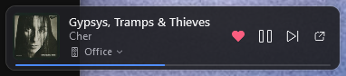

# MA Mini

A tiny always-on-top Windows widget for [Music Assistant](https://music-assistant.io/). It sits in a corner of your desktop and shows what's playing on a speaker you choose.



## Features

- Album art, title, artist and a thin progress bar
- Play/pause, next track and a ♥ button that adds or removes the current track from your MA favourites
- Speaker picker: click the speaker name under the artist. Groups show their member count. There's an optional **Follow active speaker** mode.
- Click the album art to shrink the widget down to just the art; click it again to expand. The ↗ button (or the tray menu) opens the full Music Assistant web UI.
- Mouse wheel over the widget changes the speaker volume
- System tray icon with the same menu as right-clicking the widget: playback, speaker, show/hide, always on top, lock position, click-through, album art only, move to corner, reconnect, settings, copy diagnostics and exit
- Drag to move. The widget snaps to screen edges and remembers its position per monitor. It is kept on-screen when displays change.
- Keyboard media keys (see below), plus configurable global shortcuts (default **Ctrl+Alt+M** toggles the widget)
- Auto-hide when a fullscreen app or game is on the same monitor
- Automatically pause Music Assistant when active audio from the Microsoft Teams desktop app is detected. In Settings, optionally resume the same speaker after the audio session ends (off by default); music already paused before the call, or resumed manually during it, is not touched. Detection uses Windows audio sessions, so audio-session activity is only an approximation of call status.
- Light, dark and high-contrast themes (follows Windows by default), adjustable opacity
- Auto-reconnect with back-off, including after sleep and network changes
- Start with Windows (optional) and track-change notifications (optional)
- Single instance: launching it again just shows the widget

## Requirements

- Windows 10 (2004 / build 19041) or later
- [.NET 8 Desktop Runtime](https://dotnet.microsoft.com/download/dotnet/8.0)
- A Music Assistant server, version 2.x (tested with 2.10)

## Setup

1. Run `MaMini.exe`. Settings opens on first run.
2. **Server URL**: click **Find** to discover servers on your network, or type one:
   - Standalone or Docker: `http://<host>:8095`
   - Home Assistant add-on: `http://<home-assistant-host>:8095` (the add-on exposes port 8095; the ingress URL won't work)
   - Behind a reverse proxy: `https://music.example.com`
3. **Access token**: in the Music Assistant web UI open **Settings → Profile**, create a long-lived token and paste it in. The token is encrypted with Windows DPAPI for your user account.
4. Click **Test connection**, pick a speaker and **Save**.

## Media keys

Pick how the keyboard's play/pause, next, previous and stop keys are handled in **Settings → Keyboard**:

| Mode | How it works | When to use it |
| --- | --- | --- |
| **Windows media controls** (default) | Registers with Windows' System Media Transport Controls. It shows in the volume flyout and lock screen with art, and plays nicely with other media apps (Windows routes keys to the most recent session). | Most people |
| **Global hotkeys** | Registers the media keys as system hotkeys. MA Mini always gets them, but registration fails if another app already owns them. | If Windows keeps routing keys to another app |
| **Keyboard hook** | A low-level hook that consumes media keys *only while MA Mini is connected to a speaker*. It can optionally capture the volume keys to control the speaker volume instead of Windows. | If you want the keyboard's volume keys to control the speaker |
| **Off** | Media keys are ignored | |

## Files

- Settings: `%APPDATA%\MaMini\settings.json`
- Log: `%APPDATA%\MaMini\mamini.log` (use **Copy diagnostics** in the tray menu when reporting issues; the token is redacted)

## Building

```powershell
dotnet build MusicAssistantMini.sln
dotnet test MusicAssistantMini.sln
dotnet run --project src/MaMini.App
```

The .NET 8 or newer SDK is required. `src/MaMini.Core` holds the Music Assistant client, state and settings (UI-free, unit-tested against a fake server). `src/MaMini.App` is the WPF widget.
